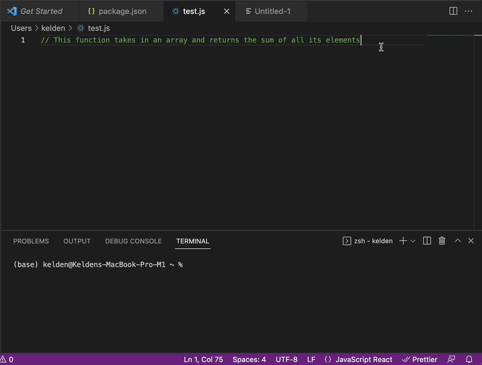

# Fleece


Fleece is a Visual Studio Code extension that allows developers to generate code using natural language. It's powered by [dalai](https://github.com/cocktailpeanut/dalai), an open source project that uses [llama.cpp](https://github.com/ggerganov/llama.cpp) and [alpaca.cpp](https://github.com/antimatter15/alpaca.cpp) language models to understand and interpret natural language.

## Demo



_The above demo showcases the comment-to-code feature of Fleece in real-time on an M1 Mac._

## Installation

1. Install Dalai globally:

```
npm install dalai -g
```


2. Follow the steps [here](https://github.com/cocktailpeanut/dalai#just-run-this) to install the models via dalai's readme.

3. Install the Fleece extension from the Visual Studio Code extension store (TBA) or by building it from this repo or downloading the latest `.vsix` [release](https://github.com/keldenl/fleece/releases) in this repo.

## Usage

Fleece currently has one feature: comment-to-code. An indicator for the hotkeys to trigger comment-to-code will show up automatically on comments. Simply press `command+option+c` on Mac to trigger the process. This will automatically start a Dalai server and send the comment as a request.

_Note that Fleece is limited by the model used and the training data, so it's only as good as the Llama or Alpaca model. More features like autocomplete or language chatbot to answer questions will be added in the future._

## Contributing

Contributions to Fleece are welcome! To contribute, follow these guidelines:

1. Clone the repo.
2. Create a new branch.
3. Make your changes and commit them.
4. Open a pull request (PR) and describe your changes.
5. Collaborators will review the changes and approve/merge if they are satisfactory.

## Coding Guidelines

When contributing to Fleece, please follow these coding guidelines:

- Write clean and readable code with proper indentation and comments.
- Use meaningful and descriptive variable and function names.
- Keep functions short and focused on one task.
- Test your code thoroughly before committing changes.
